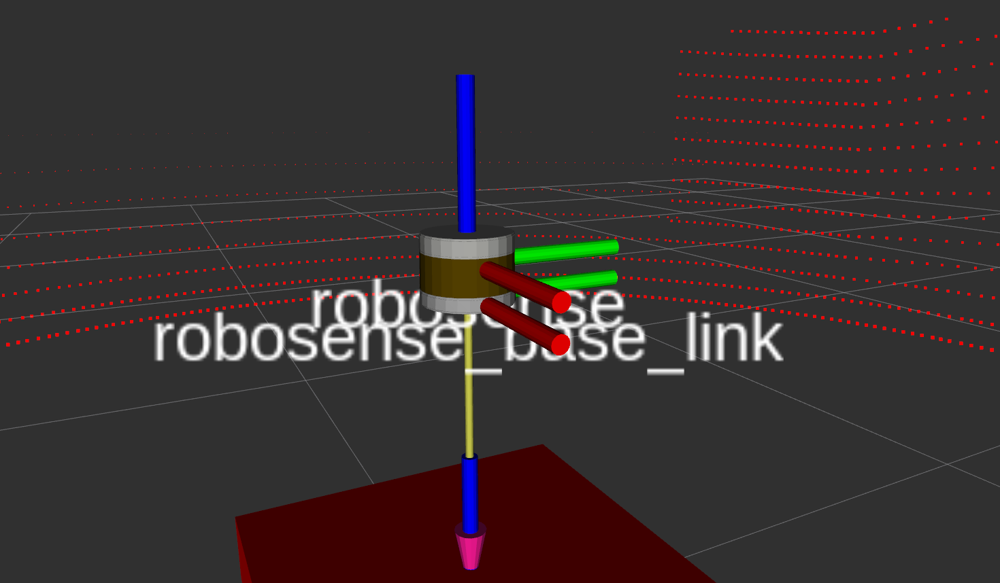

# Robosense Simulator
URDF description and Gazebo plugins to simulate Robosense laser scanners. Cloned and adapted from [velodyne_simulator](https://bitbucket.org/DataspeedInc/velodyne_simulator)




# Features
* URDF with colored meshes
* Gazebo plugin based on [gazebo_plugins/gazebo_ros_block_laser](https://github.com/ros-simulation/gazebo_ros_pkgs/blob/kinetic-devel/gazebo_plugins/src/gazebo_ros_block_laser.cpp)
* Publishes PointCloud2 with same structure (x, y, z, intensity, ring)
* Simulated Gaussian noise
* GPU acceleration ([with a modern Gazebo build](gazebo_upgrade.md))
* Supported models:
    * [RS-LiDAR-16](robosense_description/urdf/RS-16.urdf.xacro)
    * Pull requests for other models are welcome
* Experimental support for clipping low-intensity returns

# Parameters
* ```*origin``` URDF transform from parent link.
* ```parent``` URDF parent link name. Default ```base_link```
* ```name``` URDF model name. Also used as tf frame_id for PointCloud2 output. Default ```robosense```
* ```topic``` PointCloud2 output topic name. Default ```/rs_points```
* ```hz``` Update rate in hz. Default ```20```
* ```lasers``` Number of vertical spinning lasers. Default ```RS-16: 16```
* ```samples``` Number of horizontal rotating samples. Default ```RS-16: 900```
* ```min_range``` Minimum range value in meters. Default ```0.9```
* ```max_range``` Maximum range value in meters. Default ```130.0```
* ```noise``` Gausian noise value in meters. Default ```0.008```
* ```min_angle``` Minimum horizontal angle in radians. Default ```-3.14```
* ```max_angle``` Maximum horizontal angle in radians. Default ```3.14```
* ```gpu``` Use gpu_ray sensor instead of the standard ray sensor. Default ```false```
* ```min_intensity``` The minimum intensity beneath which returns will be clipped.  Can be used to remove low-intensity objects.

# Known Issues

# Example Gazebo Robot
```roslaunch robosense_description example.launch```

# Example Gazebo Robot (with GPU)
```roslaunch robosense_description example.launch gpu:=true```
